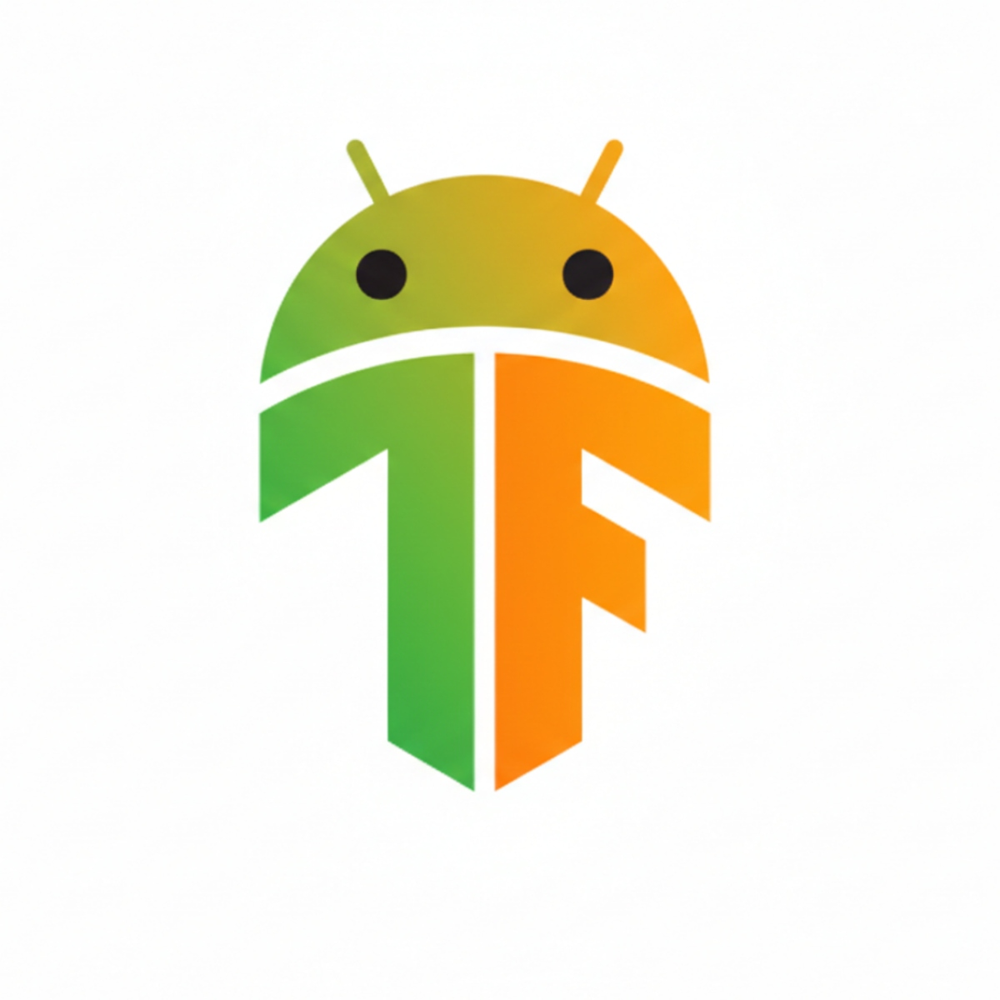

# TensorBoard Viewer for Android

  

A lightweight Android app for viewing TensorBoard logs directly on your phone, fully offline.

## Why this exists

I was on vacation with no laptop. Just my phone.
Meanwhile, new experiment results kept coming in as TensorBoard logs. I wanted to check them, compare runs, *see what was going on*.

Turns out there was no comfortable way to do that on Android.

~~So I made one.~~ Gemini & Claude made one. 

## Vibe Code Alert ⚠️

This app is **99.9% vibe coded**. Huge thanks to Gemini 3 Pro and Claude Sonnet 4.5.

A few honest notes:

1. I’m genuinely impressed it turned out this well.
2. This is **not** how I usually write software 🙂 My other projects are not vibe coded. 
3. The app is by Gemini & Claude. My role here was mostly prompting, plus fixing a couple of tiny issues when the AI stumbled (literally ~3 lines of code).
4. Despite all that, the app is actually useful, which is why I decided to share it.
5. It’s provided as-is. I take no responsibility for any consequences arising from its use.

Use responsibly, preferably on vacation 🏖️

## Features

* **Multi-run comparison** with color-coded lines
* **Interactive charts** with independent horizontal and vertical zoom
* **Run toggles** to show or hide specific experiments
* **Outlier filtering** for cleaner plots
* **Range selection** to inspect min/max values over steps
* **Recursive log discovery** in nested directories
* **Fully offline** using local files only

## Demo

  

# Summary of the Code

[Code summary (by Claude)](CodeInfo.md)